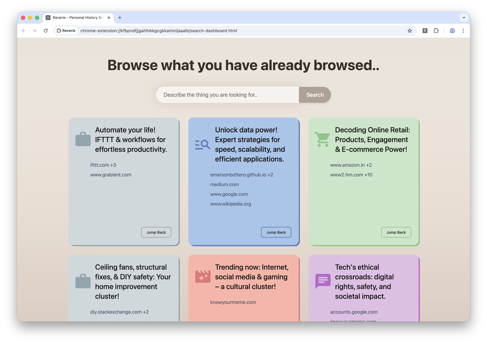
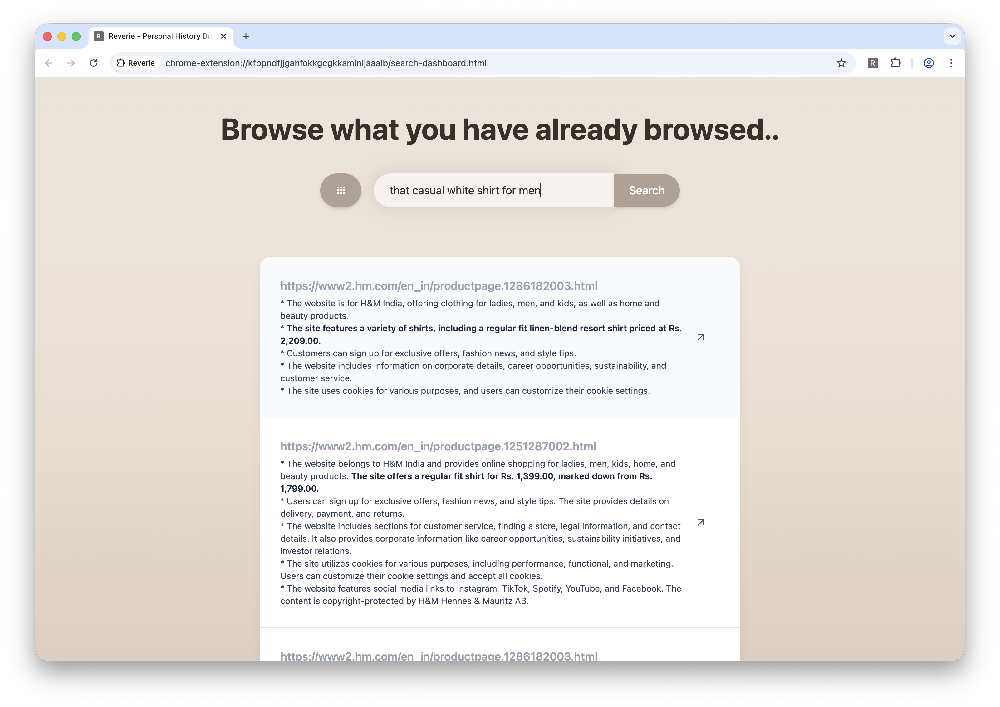

<h1 align="center">:sparkles: Reverie :bookmark:</h1>
<div align="center">

</div>
<div align="center">
  <strong>Personalized History Browsing powered by Local AI</strong>
</div>
<br/>

<p align="center">
  </img>
</p>

Reverie is a personal browser history navigation extension which understands your web browsing patterns to help you find that one thing you saw on internet before but cannot find that again.

Reverie is powered by Chrome's Built In AI capabilities using **100% Local AI**. Your data stays with you.




## Setup

Install the dependencies:

```bash
pnpm install
```

## Get started

Start the dev server, and the app will be available at [http://localhost:3000](http://localhost:3000).

```bash
pnpm dev
```

Build the app for production:

```bash
pnpm build
```

Preview the production build locally:

```bash
pnpm preview
```

## Learn more

To learn more about Rsbuild, check out the following resources:

- [Rsbuild documentation](https://rsbuild.rs) - explore Rsbuild features and APIs.
- [Rsbuild GitHub repository](https://github.com/web-infra-dev/rsbuild) - your feedback and contributions are welcome!
